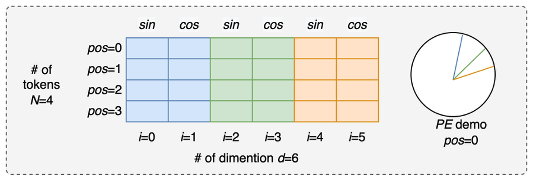
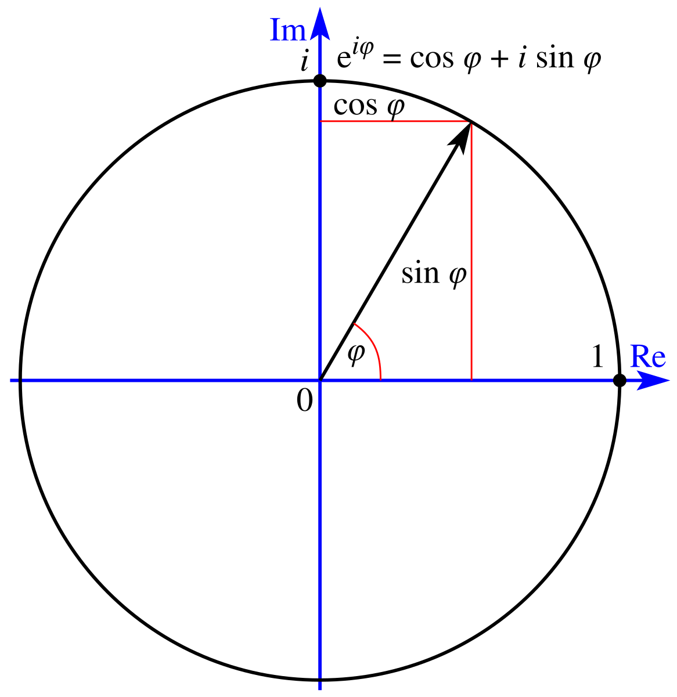
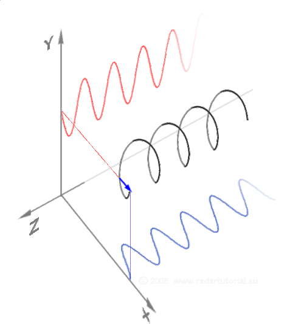
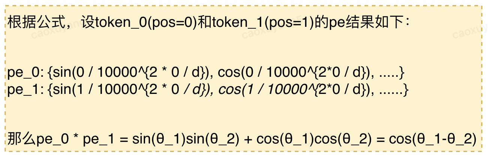

# 绝对位置编码

## 前言

在旋转位置编码(ROPE)这篇文章中，再一次提到绝对位置编码，ROPE还是沿用了绝对位置中的很多思想，因此本文整理一下绝对位置编码的相关内容。

这篇文章主要想尝试利用最少的公式，尝试回答绝对位置编码中的几个问题，包括为什么要设计成在奇数和偶数位设计成正余弦交替的形式？为什么这样设计就可以起到位置编码的作用？这么设计的初衷到底是什么？然后再通过代码来看一下具体实现方式。

## 公式
我先把绝对位置编码的公式放在这里，方便后续介绍，你可以先不用看里面的细节，后续在返回来看就可以。

$$
\begin{aligned}
&PE(pos, 2i) = sin(\frac{pos}{10000.0^{2i / d}}) \\
&PE(pos, 2i+1) = cos(\frac{pos}{10000.0^{2i / d}})
\end{aligned}
$$

这里我们把$\frac{pos}{10000.0^{2i / d}}$部分重命名为$\theta$。

## 初衷
理解绝对位置编码的初衷，我认为比公式本身更重要，因为说实话公式不难。下面请跟着我的思路理解一下：

位置编码，顾名思义就是让模型知道某个token在整个文本/图像序列中到底来自哪里，增加模型对每个token的空间感知能力。这个概念很多文章介绍的更详细，这里不过多介绍。

我们想更进一步理解一下，到底使用什么指标来表达两个不同的token来自不同的位置呢？

绝对位置编码给出的思路是把每个token看成向量，然后让不同向量的在平面上的角度不同，利用角度差来表示这种不同位置的信息，我个人觉得这里有2个很巧妙的点：

巧妙设计位置编码向量：
对于每个token的位置编码向量，假设这个向量是$d$维，那么我把这个$d$维向量按顺序两两分组，组成$d/2$个复平面中的向量（也就是$\cos(\theta)+i \sin(\theta)）$。不同组别的向量如果在复平面上来表示，就可以理解为一个个角频率不同的旋转向量，如下图所示。图中，我们绘制了每个token的向量维度是6，那么可以组成3组旋转向量，并且维度越低的部分，角频率越高，转速越快。具体来说，公式中的$i$越小，$\theta$越大，因此转速越快。换怒话说，也就是转速蓝色>绿色>橙色。



图:绝对位置编码示意，通过在dimention维度上两两组合，位置向量可以转换为复平面内的旋转向量，因此携带了绝对位置信息。这个绝对位置信息后续会加到原始embedding中。

像不像时钟？蓝色是秒针，绿色是分针，橙色是时针。这样，我们就可以区分第一个token来自10点20分10秒，第二个token来自10点21分50秒，是不是给了每个向量一个绝对的位置？

> 注1：读到这里，你是不是感觉特别像傅里叶变换的思想，也就是把时域信号通过不同频率的频域信号组合进行表达。

> 注2：如果你不太理解为什么上述操作就可以用复平面中不同角频率的旋转向量表示，建议重温一下世界上最美的公式，欧拉公式。这里我放了两个图供理解。


图：欧拉公式示意图


图：欧拉公式示意图

巧妙利用矩阵相乘：
刚刚我们给每个token的embedding设计了一个位置编码，并且加到了原始的embedding中。那么通过自注意力运算之后，会出现什么呢？

回顾attention中的$Q\cdot K^{T}$，通过矩阵相乘，我们发现在不同向量之间，竟然还出现了相对位置信息。具体地，我们发现通过刚才的编码和矩阵点乘，可以构造出:

$$\cos\theta_1\cos\theta_2+\sin\theta_1\sin\theta_2 =\cos(\theta_1 - \theta_2)$$

其中$\theta_1$和$\theta_2$是不同位置处对应维度上的角度差，而这个角度差，就可以表示两个token之间的相对位置了。

一个示例如下图所示：

> 这里用到了三角函数中的和角公式，中学时代最头疼的公式之一。

通过上述设计，我们就给每个token加上了一个绝对位置编码，同时通过attention中的矩阵点乘，我们还发现构造出了不同token之间的角度差，可以用作不同token之间的相对距离。

关键点：
下面列出了我理解绝对位置编码过程中的一些关键信息
1. **核心思想**：为序列中每个位置分配一个固定的、独立于上下文的正弦-余弦向量，让模型直接知道“这个 token 在第几号位置”。
2. **公式中变量的理解**：假设我们的一个序列embedding之后的维度是$(N, d)$，那么pos是$N$这个维度的变量，而$i$是$d$这个维度的变量。因此，随着$i$变大，三角函数的频率线性减小，并且由$d$来做归一化，使得频率的变化范围永远在[1/10000, 1]区间，这样不同的$d$也能具有相同的编码属性。
3. **为什么奇偶位置要设计为正余弦**：这样的设计需要结合attention的点乘一起来看，通过$Q*K$点乘，结合PE的正余弦编码，可以构造一组组和角公式，也即$cos(A−B)=cosAcosB+sinAsinB$，这样我们可以在当前这个频率下来描述两个token之间的角度差，也就是相对距离。同时在$d$这个维度上，由于两两成组，假设$d$的维度是512，那么我们就可以用256个不同的频率，来描述token1和token2之间($N$维度)的相对距离。


代码：
```python
import math
import torch

# PE(pos, 2i) = sin(pos * (1 / (10000 ** (2 * i / d))))
# PE(pos, 2i + 1) = cos(pos * (1 / (10000 ** (2 * i / d))))
# 1 / 10000 ** (2 * i / d) = exp(2 * i / d) * log(10000)

def absolute_positional_encoding(seq_len, d_model):
    pe = torch.zeros((seq_len, d_model)) # (seq_len, dmodel)
    pos = torch.arrange(0, seq_len).unsqueeze(-1) # (seq_len, 1)

    div_term = torch.exp(-1 * torch.arrange(0, seq_len, 2) * math.log(10000.0) / d_model)
    
    pe[:, 0::2] = math.sin(pos * div_term)
    pe[:, 1::2] = math.cos(pos * div_term)

    return pe
```